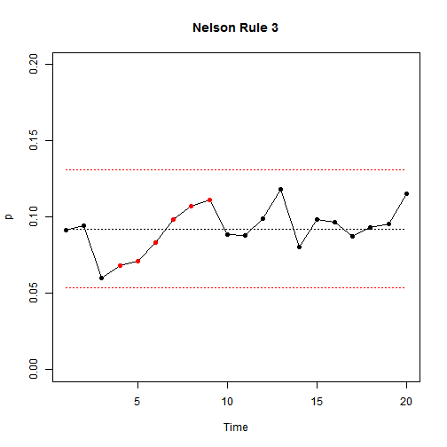

pchartr
=======

pchartr is a collection of tools for analyzing control charts, specifically p-charts.

Usage Scenarios
===============

Ultimately this package will serve two purposes:  

1. Provide support for programatically detecting out-of-control points in a control chart.  
2. Provide functionality for determining the minimum sample size to detect an out-of-control situation with a specified degree of confidence.  

Functions
=========

There are functions for checking control charts for violations of the eight [Nelson rules](http://en.wikipedia.org/wiki/Nelson_rules).


* `nelson.rule1()` checks for any points outside the upper and lower control limits.
* `nelson.rule2()` checks for nine or more points in a row on the same side of the mean.
* `nelson.rule3()` checks for six or more consecutive increasing or decreasing points.
* `nelson.rule4()` checks for fourteen or more points alternating in direction.
* `nelson.rule5()` checks for two out of three points that are more than two standard deviations from the mean.
* `nelson.rule6()` checks for four out of five points that are more than one standard deviation from the mean
* `nelson.rule7()` checks for fifteen consecutive points within one standard deviation of the mean.
* `nelson.rule8()` checks for eight consecutive points with none within one standard deviation of the mean.

Example
=======


```r

library(pchartr)

# Set up data
x <- c(0.0912, 0.0942, 0.0601, 0.068, 0.0712, 0.0836, 0.0984, 0.1069, 0.1114, 
    0.0887, 0.0881, 0.099, 0.1184, 0.0802, 0.0986, 0.0966, 0.0876, 0.0933, 0.0954, 
    0.1155)

# Caclulate the mean value
mean <- rep(mean(x), length(x))

# Calculate upper and lower control limits
n <- 500
sd <- sqrt(mean(x) * (1 - mean(x))/n)
ucl <- mean + 3 * sd
lcl <- mean - 3 * sd

# Nelson's first rule checks for any points outside the upper and lower
# control limits
nelson.rule <- nelson.rule3(x, mean, ucl, lcl)

# Show the results
nelson.rule
```

```
## 
## Nelson Rule 3: 6+ points increasing or decreasing
## 
## Violated: TRUE
## Tested against dataset of length 20
## First detected at point 9
## Which: 4, 5, 6, 7, 8, 9
```

```r

# Plot the results
plot(nelson.rule, ylim = c(0, 0.2), xlab = "Time", ylab = "p", main = paste("Nelson Rule", 
    nelson.rule$rule))
```

 

